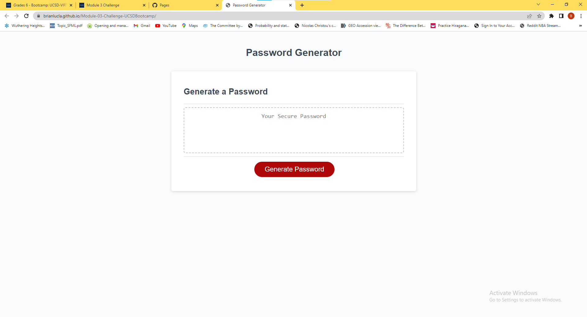

# Random Password Generator

## Description

We were motivated to build an application that would allow people to create safe and secure passwords. We built this project to ensure the safety of our users. This project solves the problem of using unsecure passwords to protect sensitive information from being accessed by outside parties. From this project, I learned how to use JavaScript to take in user input and interact with the HTML.

## Installation

N/A

## Usage

To use this application, the user must first input the desired length of the password. Then, the user must confirm whether or not they want special, numeric, lowercase, and/or uppercase character types in their password. Then, the program will generate a random password from these conditions.

Screenshot:

Link to deployed website: https://brianlucla.github.io/Module-03-Challenge-UCSDBootcamp/

## Credits

N/A

## License

Please refer to the license in the Github Repository

---

